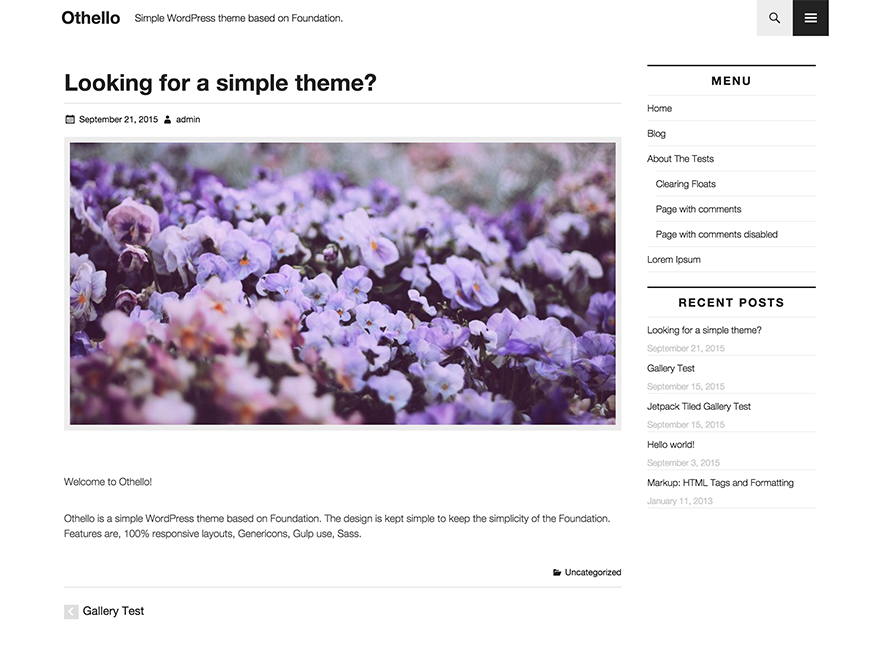

Othello
============



Simple WordPress Theme based on Foundation

## Requires

* Bower
* gulp
* Node.js
* npm
* Ruby
* Sass >=3.4
* sass-globbing

## Setup your project

1.  Install gulp.


        $ npm install -g gulp


2.  Install some dependencies.


        $ cd path/to/directory ; npm install
  

3.  Install sass-globbing.


        $ gem install sass-globbing


4.  Install bower_components and initialize them.


        $ npm run gulp-init

5.  To run gulp tasks with proxy mode, Set hostname on line 18 in gulpfile.js.


        'vhost'          : 'example.dev'
    

5.  Run gulp.

        // proxy mode
        $ gulp

        // server-mode for static websites
        $ npm run gulp-server

### foundation

    src/scss/core/foundation/
    src/scss/core/_settings.scss
    src/scss/core/_foundation.scss

### autoprefix

You'd like to autoprefix specific browsers, edit gulpfile.js below these lines.

```javascript
.pipe($.autoprefixer({
  browsers: ['last 2 versions', 'ie 10', 'ie 9'],
  cascade: false
}))
```

## License

GNU GENERAL PUBLIC LICENSE Version 2
