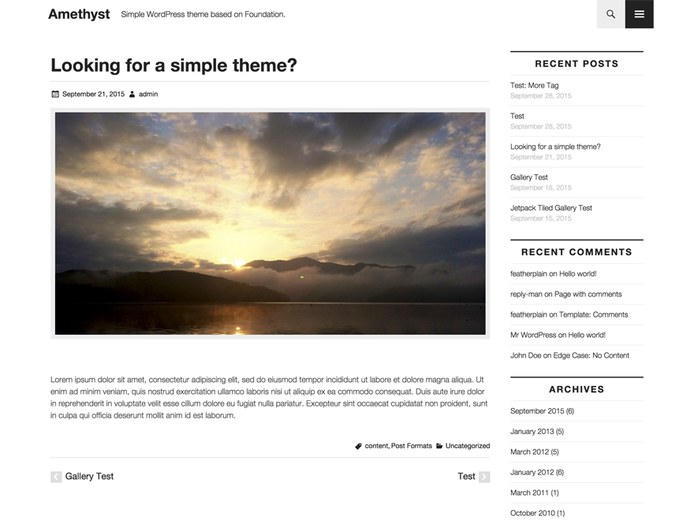

Amethyst
============

[](http://deploybot.com)
[](https://travis-ci.org/featherplain/amethyst)

Simple WordPress Theme based on Foundation. See details at [readme.txt](readme.txt).



- Download: [https://wordpress.org/themes/amethyst/](https://wordpress.org/themes/amethyst/)
- GitHub Page: [http://featherplain.github.io/amethyst/](http://featherplain.github.io/amethyst/)
- Theme demo: [http://amethyst.asknode.net/](http://amethyst.asknode.net/)


## Requires

- Node.js
- npm
- Composer

## Setup your project


1. Make WordPress environment.


1. Install some dependencies, and set your hostname.Default is `amethyst.dev`.


        $ cd path/to/directory && npm run setup
        Set your website's domain (default=amethyst.dev):


1. To run gulp tasks with proxy mode, you can update hostname in `config.js`. This configuration file is NOT tracked by git.


        'vhost'          : 'amethyst.dev'


1. Run gulp. You don't need to install gulp globally.

        // proxy mode
        $ npm run gulp

        // server mode for static websites or files
        $ npm run gulp-server

1. Run automated testing.

        $ npm test

### Options

#### Initialize Foundation

    $ npm run foundation-init

#### Distribution

    $ npm run gulp-zip

#### Autoprefix

You'd like to autoprefix specific browsers, edit gulpfile.js below these lines.

```javascript
.pipe($.autoprefixer({
  browsers: ['last 2 versions', 'ie 10', 'ie 9'],
  cascade: false
}))
```

## Third Party Resources

### Foundation

    src/scss/core/foundation/
    src/scss/core/_foundation.scss
    src/scss/core/_global.scss
    src/scss/core/_settings.scss

- License: MIT
- Source: [http://foundation.zurb.com/sites.html](http://foundation.zurb.com/sites.html)

### Genericons

    assets/genericons/

- License: GPLv2
- Source: [http://genericons.com/](http://genericons.com/)

### Font Awesome

    assets/font-awesome/

- License:
  - Font License: SIL OFL 1.1
  - Code License: MIT License
- Source: [https://fortawesome.github.io/Font-Awesome/](https://fortawesome.github.io/Font-Awesome/)

### HTML5 Shiv

    src/js/html5shiv.js

- License: MIT/GPL2 License
- Source: [https://github.com/aFarkas/html5shiv](https://github.com/aFarkas/html5shiv)


## License

[GNU GENERAL PUBLIC LICENSE Version 2](license.txt)

## Contributors

Thanks to @torounit, @miya0001
